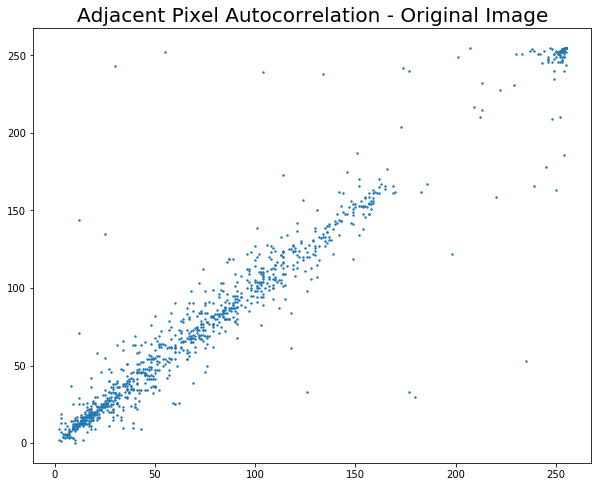
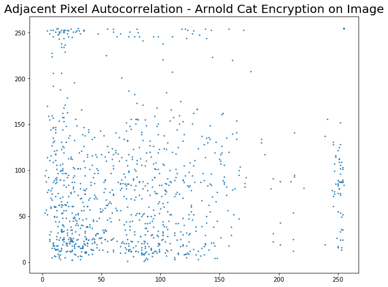
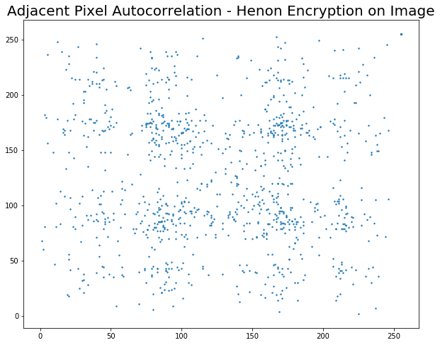
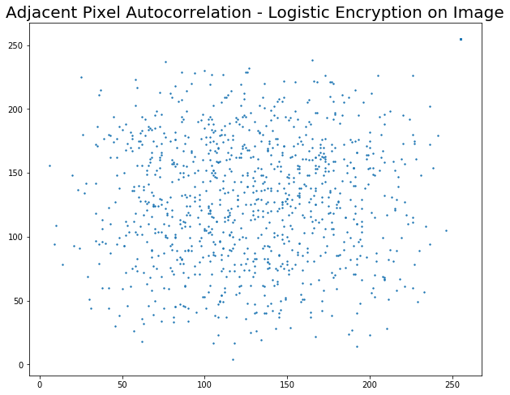
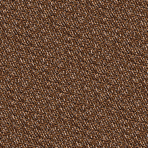
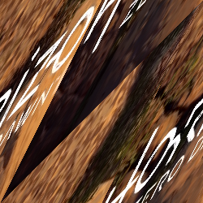
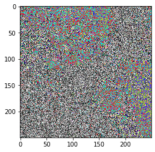
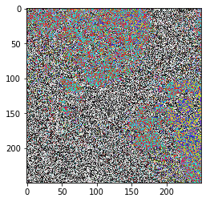
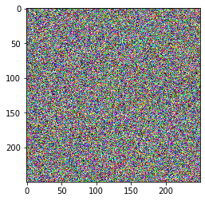
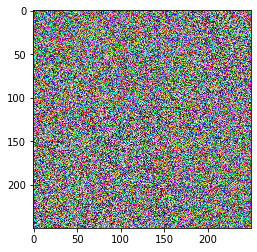

# Image Encryption using Chaos Maps
This is a project in cryptography that involves implementing image encryption using various chaos maps and comparing their merits based on key sensitivity, adjacent pixel autocorrelation and intensity histograms. The chaos maps implemented were - Arnold cat maps, Henon maps and Logistic chaos maps.
 

<b> What are chaos maps? </b>
 
Chaotic systems are a simple sub-type of nonlinear dynamical systems. They contain a few interacting parts which follow simple rules, but these systems are characterized by a very sensitive dependence on their **initial conditions**. Despite their deterministic simplicity, over time these systems can display and divergent behavior.

 

**Why Chaos Maps for encryption?**
 
Traditional encrypting mechanisms AES and RSA exhibit some drawbacks
and weakness when it comes to encryption of digital images 
  and high computing

*   Large computational time for large images
*   High computing power for large images
Consequently, there might be better techniques for image encryption.

 

A few chaos based algorithms provide a good combination of speed, high security complexity, low computational overheads 
Moreover, **certain** chaos-based and other dynamical systems based algorithms have many important properties such as 

*   sensitive dependence on initial parameters
*   pseudorandom properties
*   ergodicity
*   non periodicity
# Images
### Original Image

### Encrypted Images

### Image after Arnold Cat Encryption

### Image after Henon Map Encryption

### Image after Logistic Map Encryption

# Intensity Histogram

# Adjacent Pixel Autocorrelation

 

# Key Sensitivity
## Henon Map
### Original Image

### Encrypted with key = 20

### Decrypted with key = 19

## Arnold Cat
### Original Image

### Encrypted with key = 20

### Decrypted with key = 19

## Henon Map
### Original Image

### Encrypted with key = (0.1, 0.1)

### Decrypted with key = (0.1, 0.101)

## Logistic Map
### Original Image

### Encrypted with key = "supersecretke"

### Decrypted with key = "supersecretke"

